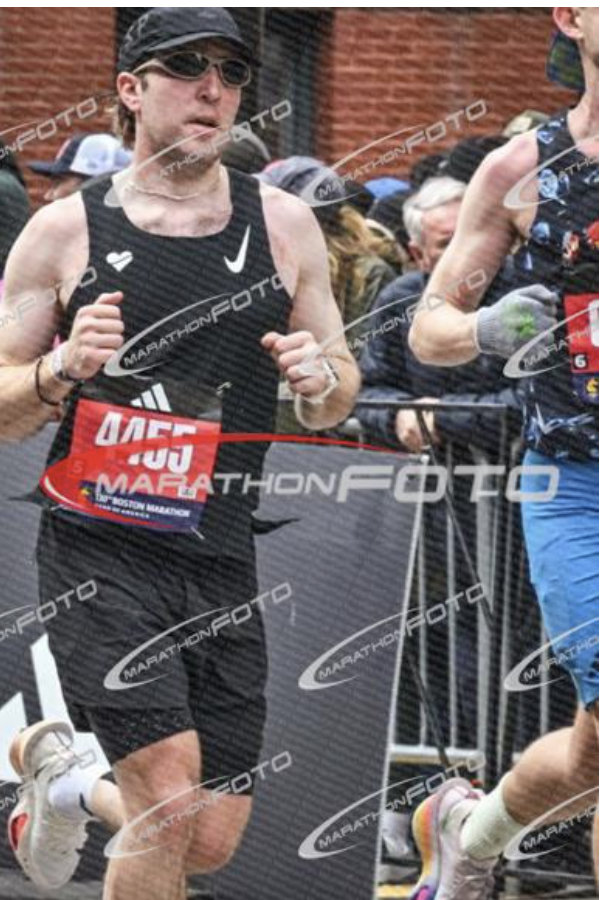
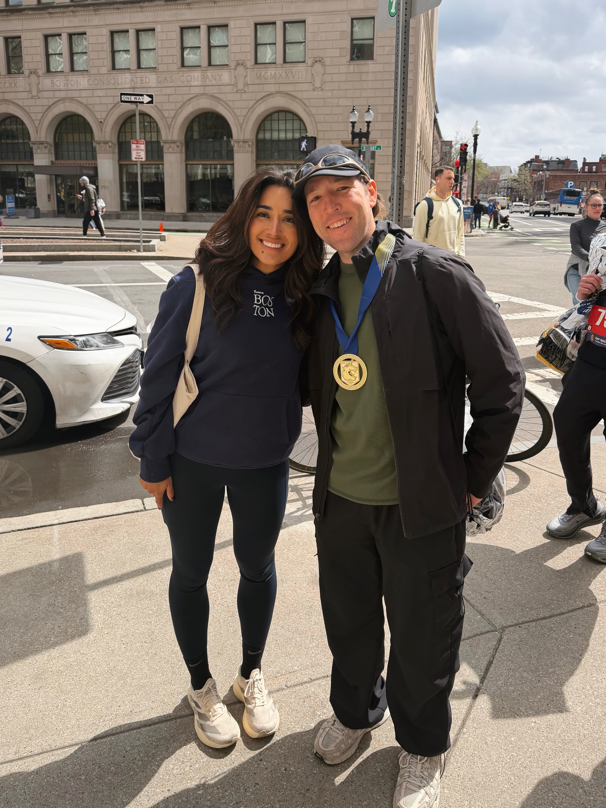

The first time I ran Boston, I'd torn a tendon three weeks before the start and forgotten my watch at the hotel. The whole thing was a (very painful) victory lap that had a lot of meaning as my first time doing Boston.

This time was supposed to be different. I wanted both: Boston as a victory lap, and Boston as a real race. I told everyone who asked that the goal was to get a sub-3 for a Boston course PR.

My final time 3:00:38 😂

### Pre-Race

Leading up to the race, I had sixteen to eighteen weeks of clean runway, so I wanted to hit sixty- to seventy-mile weeks, and I had the very dumb idea to front-load it with trail miles and inclined tempos to get my legs ready for Newton. Trail running plus hill tempos plus speed work, all stacked into the same window did exactly what you'd expect. My Achilles got lit up. I lost almost eight weeks of the block to PT and easy spinning to get myself back to pain-free running.

I peaked around 38 miles per week. For Berlin, I put down nearly double that during the training block (that was also even shorter).

Sub-3 was still the goal. I knew that with the last few training runs, I had the engine at least. What I didn't know was whether half the usual mileage would hold me together through the back six. I knew I'd be closer to like a 2:58, with room to slide to a 2:59. The plan was a deliberately conservative first half, room to absorb the hills, then run the last 6 on whatever was left.

The week of the race I was, somehow, just calm, like actually calm. The training block had humbled the ambition out of me, and the few long runs I'd salvaged in the back half of the cycle had felt pretty good. The last big one was paced inside a TSP-build session with other folks rotating their relay legs out in the Mojave, and I knew the 6:30s and 6:40s could still be part of the plan.

When people asked me what I was going for, I just kept saying "sub-3 and I'll be happy." After my Berlin PR, in my head that should not have been too big of an ask.

### Race Day

not a single good photo this year sadly, so here's a marathonfoto watermark one

#### Start

Having done the Athletes' Village process once before, the morning moved pretty smooth. Nutrition dialed, bathroom situation was manageable, and a solid warmup all before getting into the corral.

Right before we started, I ran into Paul and Mike, the famous Burrito Bandits (from the 2023 post), and they asked if I wanted to roll out with them and target a 2:45. I really, really wanted to say yes. I knew if I said yes I'd be sitting on a curb at mile 19, so I told them I'd see them after.

#### First 16

Everyone's advice for Boston is that the race doesn't start until mile 16. The first half is downhill-net, fast, easy on the lungs, and brutal on the Quads if you run it wrong (too slow and using your legs to break, or too fast if you rip it from the jump).

I was disciplined. I sat in my pace. I watched packs of people gun it past me on the first descent at paces almost a minute per mile faster than what I was running, and I made myself not chase. The first 16 miles felt easy as I intended. I had a negative-split plan with extra buffer baked in for Newton, and I was hitting splits within a second or two of where I wanted them.

Around the half, I caught myself thinking: *running a marathon is easy.* Pretty dumb for someone who didn't do as much volume training as they wanted.

> Running a marathon is easy. Easy Money.

I knew I was lying to myself. I let myself enjoy the lie anyway.

#### The Hills

I'd trained for this stretch specifically, and that was the whole point of the trail and incline-tempo work that broke me in January. Even with all the lost weeks and lost miles, the muscle memory of those workouts was there. I let the pace shift up into the low sevens through Newton like I planned. And also as planned, I watched some of the people who'd blown past me earlier start walking.

Heartbreak itself was incredible. The Heartbreak group was out, and I was giving high fives the whole way up the hill, and I came over the top still feeling like I had a race left in me.

But cresting Heartbreak in 2023 had been a similar feeling, a false bottom of euphoria, right before the body remembers what you've actually done to it. I felt the first real cramp-ish signal in my quads about a quarter mile past the top. I took two salt tabs and tried to get my legs to settle.

#### Mile 20 to Mile 24

By twenty I was hurting, but I was on time. My watch, which I knew was running a little fast against the actual markers, had me tracking a high 2:58, so I figured I was good and inside the buffer.

The thing I was carrying through this stretch was that Jenn was going to be at mile 24 with the Runna group. Mile twenty was the moment I started counting down to twenty-four.

The miles between hurt, probably a bit more than I thought they would given I had stayed pretty steady through the beginning miles. Either way my pace was okay and the math to get to sub-3 was still working, and I got to twenty-four. I got to see Jenn, while accidentally running myself into the railing, for quick kiss and a wave. Then it was off to just finish it out.

#### Final 2

This is where for better or worse (depending on how you look at it)... I kind of blew it.

Coming out of mile 24, the muscle fatigue I'd been managing since the top of Heartbreak set in hard. My watch — which, again, had been reading fast all day — said I was on track for a high 2:58. I had buffer. I had time. I was good!

Through the pain that usually comes with the last miles of a marathon, I had this very clear thought: *I don't want to blow up. I don't want to walk. I don't want my last mile of Boston to be a death march. I have enough margin. I'm going to slow down just a bit and take this all in.*

So I backed off a bit. I stopped checking my watch. I was engaging with the crowd, high-fiving everyone through the final turns on Boylston. The finish chute is the best 600 meters in road racing and I was going to be fully present.

The problem was I didn't realize how much I'd actually slowed down. I thought I'd backed off ten or fifteen seconds per mile. Wrong. I'd backed off about like 60 seconds per mile, and my watch that I wasn't checking had already been running fast against the official splits...

I crossed the line feeling good. Like genuinely good. I got my medal. I got to gear check.

I called Jenn to check in and figure out a regroup spot, and then I checked the actual results walking out of the finish area.

> 3:00:38.

I was pretty shocked, just because I had totally thought I was fine and didn't pay too much attention to my watch in the final mile. I realized I'd told everyone I was going for sub-3, and I had missed it by thirty-eight seconds, and I had no idea I actually didn't hit it until after it was obviously way too late.

### Reflections

There's a version of this post where I'm more upset about those thirty-eight seconds. There's a different version where I write a whole section about checking the watch one last time, about how a single sub-6:50 mile to finish would have done it, about all the math that's easy to do in hindsight.

After going through this all in my head, I told myself before the race that the real goal was to actually be present and actually race Boston this time around. Not focusing on the pain management of a torn tendon. Not zoned out on adrenaline. So, the number is the number, but the version of the race I went there to run is the version I ran, and I'm actually proud of that.

If I had known at mile 25 how close I actually was, I would have put my head down and chased it. The watch and the body both lied to me just enough to keep me from chasing. I think I'm alright with that.

> I don't think I would trade those thirty-eight seconds to suffer through Boylston.

Boston the second time was never going to be Boston the first time. The first one was a victory lap because it was my first ever and I really had no other option with my torn tendon. This one was a victory lap because I chose to make it one (even if it meant unknowingly sacrificing my goal). I also didn't really have an explicit time expectation. I was just happy to be there.

Overall, the race itself made sense with the training block. Both of them were kind of set up to be one thing and ended up being another. Both of them rewarded just showing up with doing what I could versus getting pissed off about what I didn't.

The real win was to get to come back at all, with a body/legs that (mostly) worked, in a year where the weather was perfect, and Jenn was there at mile 24 for me. Those are the details of this race I'll remember instead of 3:00 or 2:59.

